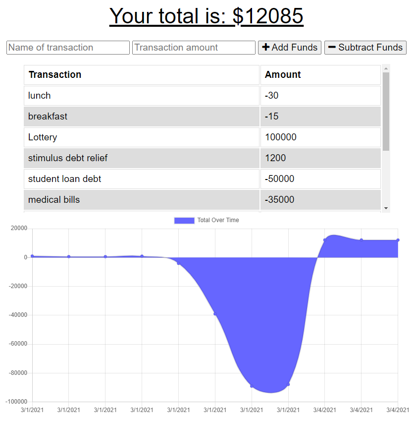

# Budget Tracker

## Table of Contents

* [Description](#description)
* [Installation](#installation)
* [Usage](#usage)
* [Credits](#credits)
* [License](#license)

## Description

Budget Tracker is an application that allows users to track their funds to help them manage a budget. It utilizes PWA technology to allow offline functionality. The user can enter a transaction offline and it will appear when back online.

## Installation

`npm install`

## Usage

`npm start`

## Credits

[Compression](https://www.npmjs.com/package/compression)

[Express](https://www.npmjs.com/package/express)

[Lite-Server](https://www.npmjs.com/package/lite-server)

[MongoDB](https://www.mongodb.com/)

[Mongoose](https://www.npmjs.com/package/mongoose)

[Morgan](https://www.npmjs.com/package/morgan)

## License

[GNU General Public License v3.0](https://choosealicense.com/licenses/gpl-3.0/)